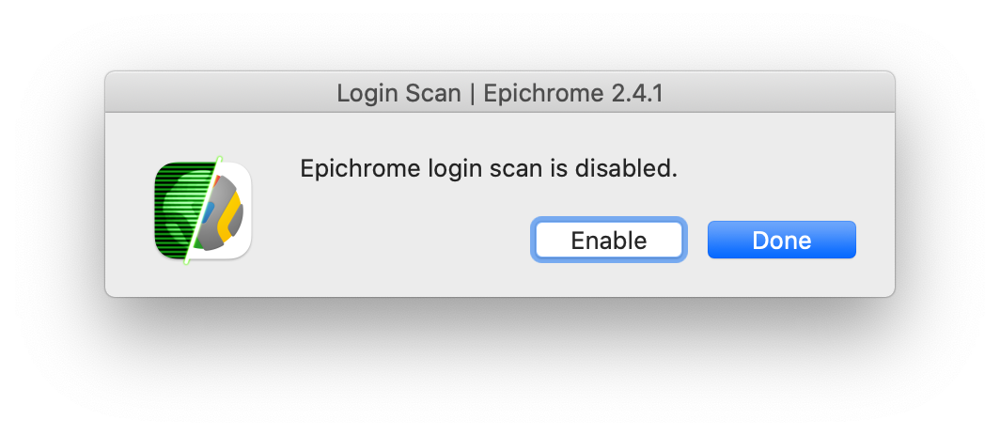
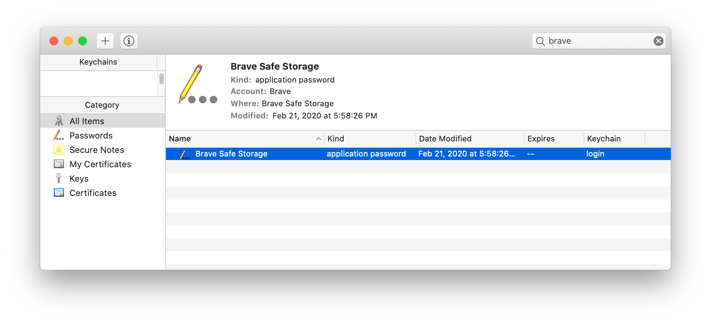
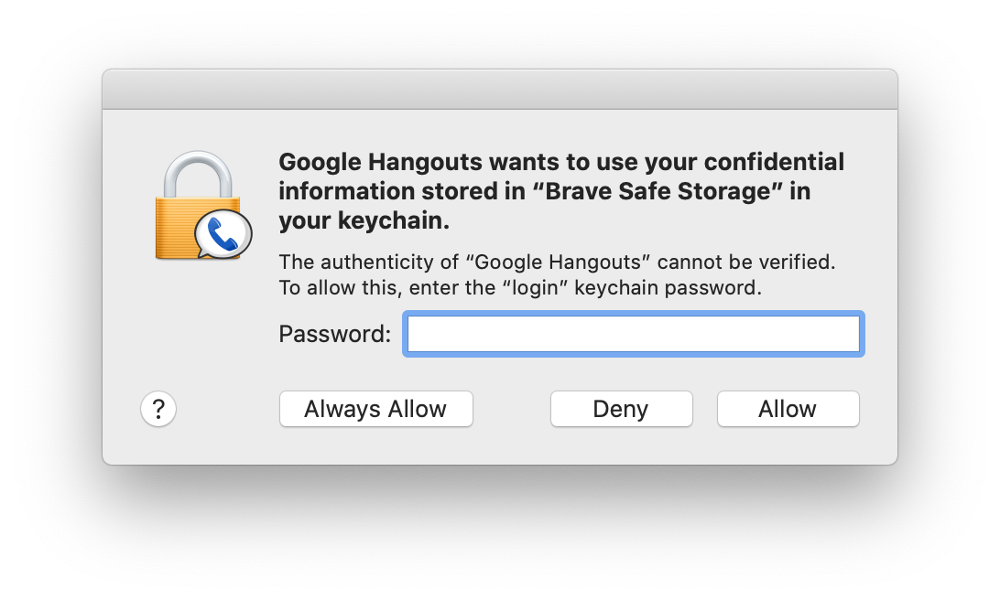
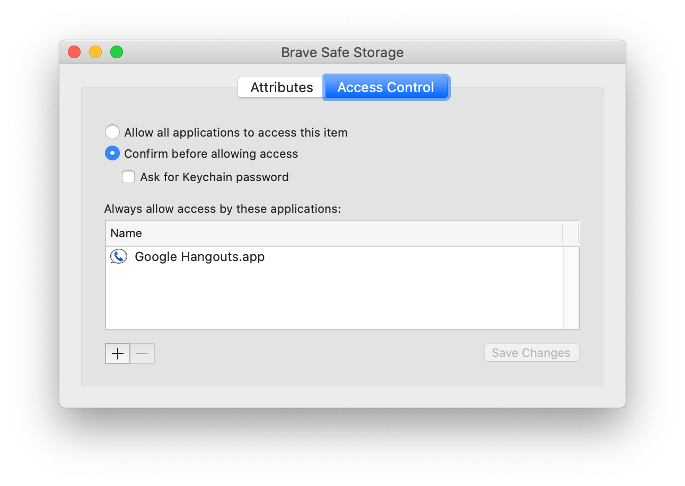
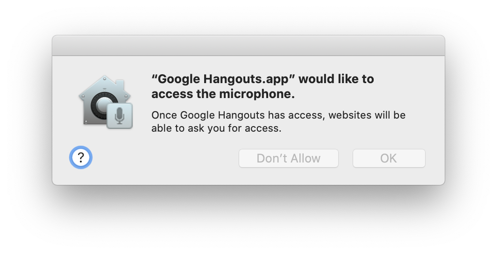

# Troubleshooting Epichrome Issues

## Contents

- [**Opening an app from the dock opens a generic browser**](#opening-an-app-from-the-dock-opens-a-generic-browser)
- [**Login data not saving**](#login-data-not-saving)
- [**Microphone, camera, or other system resource not enabled**](#microphone-camera-or-other-system-resource-not-enabled)
- [**To delete an Epichrome app**](#to-delete-an-epichrome-app)
- [**To find Epichrome application IDs**](#to-find-epichrome-application-ids)


## Opening an app from the dock opens a generic browser

Sometimes you may find that opening an app brings up a generic browser window rather than your app. This is especially likely to happen after a system crash, as it's a result of the app engine not being properly deactivated when the app quits.

Starting with Epichrome 2.4.0, the easiest way to solve this is to first make sure none of your problem apps are running, and then run `Epichrome Scan.app` (which is installed alongside `Epichrome.app`). It will show a progress bar as it scans your apps, and will show a summary of how many apps it restored.

Another highly-recommended step, which will prevent the problem from occurring after a system crash, is to enable the Epichrome login scanner. This runs automatically at login (it runs in the background and doesn't display any progress) and will silenty restore any apps left in a bad state after the crash.

The first time you run `Epichrome.app` after updating from 2.3.x to 2.4.x, it should offer you the option to enable the login scan. If you told it not to on that run, you can change your preference at any time by doing the following:

- Hold down the `Option` key as you launch `Epichrome.app`. It should bring up the following dialog:

- Click the `Enable` button

*First mentioned in [issue #202](https://github.com/dmarmor/epichrome/issues/202 "issue #202").*


## Login data not saving

This is a rare problem that seems to occur exclusively with apps using the built-in Brave engine, which sometimes fail to request access to the Brave Safe Storage key in your user keychain. (It's not clear exactly what combination of events causes it, but you can find the latest discussion in [issue #215](https://github.com/dmarmor/epichrome/issues/215 "issue #215").)

The most reliable solution I've found so far is to delete _all_ of the problem apps' browser data and delete Brave Safe Storage from your keychain.
Here's how to try this with one of your misbehaving apps:

1. Delete the `UserData` directory in your app's data directory (`~/Library/Application Support/Epichrome/Apps/<AppID>/UserData`).

1. Run `Keychain Access` and search for "Brave". You should see a window like this:

1. Delete the Brave Safe Storage item, then run the app again. The first time you run the app, you should most likely see a dialog like the one below. If you do, enter your login password and click `Always Allow`. (Sometimes this dialog doesn't appear and yet things still work, so even if you don't see it, try the testing steps below.)

1. Once the app is running, open `Keychain Access` again and search for "Brave".
Double-click `Brave Safe Storage` and click the `Access Control` button at the top.
You should see something like this:

1. The definitive test then is to enter a login/password to a site that you know will
keep you logged in (I actually use GitHub to test this) and save the password in Brave.
Then quit the app and run it again. You should still be logged in, and if you go to
Settings, you should see the password in your saved passwords.


## Microphone, camera, or other system resource not enabled

When one of your apps goes to a site that requests microphone or camera access, you will get a browser notification asking if you want to allow that site access to the resource. After you click the `Allow` button in the app, you should get a macOS dialog
asking you to give the app permission to use the resource. It will look something like this:

Sometimes that dialog takes several seconds to appear, so it's possible if you switch away from your app at the wrong moment or something, you could miss it.

Even if you don't see the dialog, try using the microphone or camera with the site, as it's possible the system has already given the app permission to use that resource, or if your app is using the external Chrome engine and you've already given Chrome access to that resource then you won't see the dialog.

If for some reason the app doesn't request access from the system and the mic or camera isn't working, try quitting the app and resetting the system permissions for the resoruce (you'll then need to give access back to each app you use it in the next time you run them). You can do it from the terminal like this:

Microphone: ```tccutil reset Microphone```

Camera: ```tccutil reset Camera```

Then run the app again, go to a site that accesses the resource, and wait
a few seconds, and the dialog should appear.


## To delete an Epichrome app

Note that not all of these files or folders will exist for every app. This is normal. Just delete the ones you find.

1. Delete `/Applications/<AppName>` (or wherever you created the SSB app)

1. Delete `/Applications/Epichrome/EpichromeEngines.noindex/<User>/<AppID>` (or
wherever Epichrome is installed)

1. Delete `~/Library/Application Support/Epichrome/Apps/<AppID>`

1. Delete `~/Library/Preferences/org.epichrome.app.<AppID>.plist`

1. Delete `~/Library/Preferences/org.epichrome.eng.<AppID>.plist`

1. Delete `~/Library/Caches/org.epichrome.app.<AppID>`

1. Delete `~/Library/Caches/org.epichrome.eng.<AppID>`

1. Delete `~/Library/Saved Application State/org.epichrome.app.<AppID>.savedState`

1. Delete `~/Library/Saved Application State/org.epichrome.eng.<AppID>.savedState`


## To find Epichrome application IDs

### Find IDs for all Epichrome apps

```
mdfind "kMDItemCFBundleIdentifier == 'org.epichrome.app.*'"
```

### Find the ID for a specific Epichrome app

```
mdls -name kMDItemCFBundleIdentifier -r /Applications/<AppName>.app
```

Adjust the application installation location as necessary.
